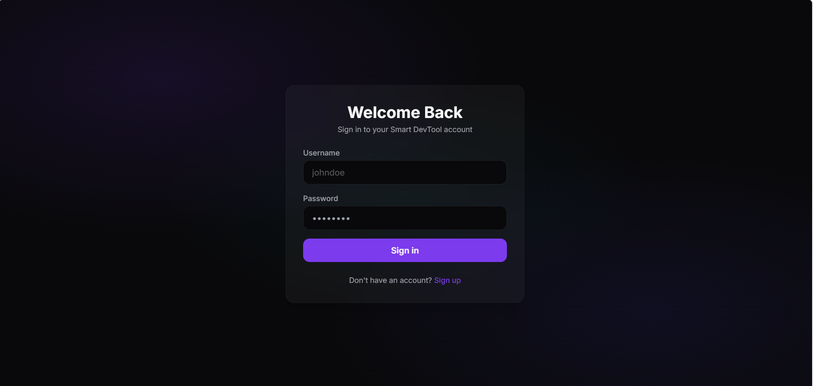
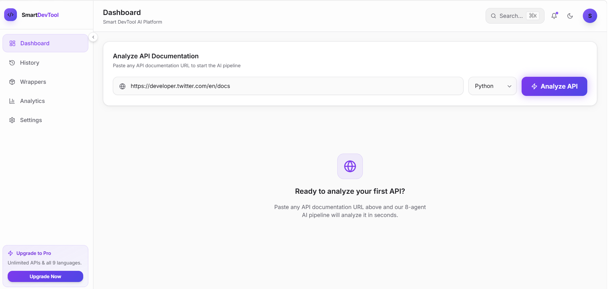
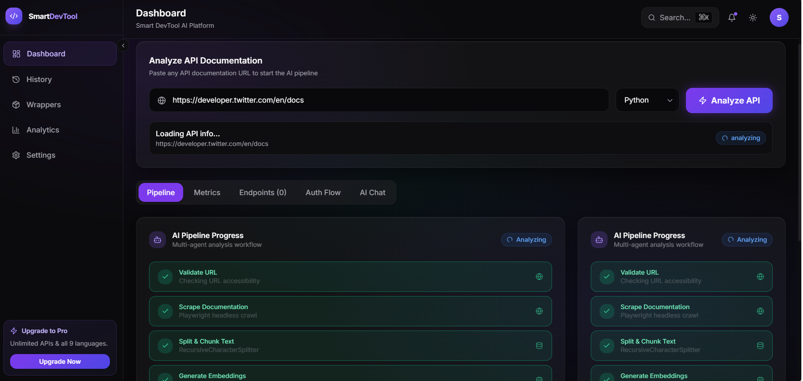
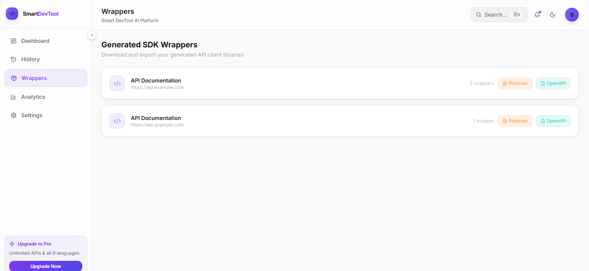

🚀 Smart DevTool for API Integration using AI

> **Stop wasting hours reading API documentation. Let AI do it for you.**

A production-ready, multi-agent AI system that crawls any API documentation, analyzes it with 8 specialized LLM agents, and generates complete, language-specific SDK wrappers — including authentication, retry logic, pagination, error handling, and unit tests.

---

✨ Features

| Category | Capabilities |
|---|---|
| **AI Pipeline** | 8 specialized agents, FAISS RAG search, LangChain orchestration |
| **Scraping** | Playwright headless Chrome + BeautifulSoup fallback |
| **Wrapper Generation** | Python, TypeScript, JavaScript, Go, Rust, Java, C#, PHP, Kotlin |
| **Exports** | ZIP packages, Postman v2.1 Collection, OpenAPI 3.0 Spec |
| **Security** | Auth detection, vulnerability scoring, rate limit recommendations |
| **UI** | Glassmorphic dark dashboard, animated pipeline visualizer, AI chat |

---

🏗️ Architecture

```
┌─────────────────────────────────────────────────────────────────┐
│                    Smart DevTool Architecture                   │
│                                                                 │
│  Frontend (Next.js 14 + TailwindCSS + Framer Motion)            │
│  ┌────────────┐ ┌──────────┐ ┌──────────┐ ┌─────────────┐       │
│  │  Landing   │ │Dashboard │ │ History  │ │  Wrappers   │       │
│  │   Page     │ │  + Chat  │ │ View     │ │  Download   │       │
│  └────────────┘ └──────────┘ └──────────┘ └─────────────┘       │
│                           │                                     │
│                    Axios API Client                             │
│                           │                                     │
│  Backend (FastAPI + SQLite + FAISS)                             │
│  ┌─────────────────────────────────────────────────────┐        │
│  │                    AI Pipeline                      │        │
│  │                                                     │        │
│  │  URL → Playwright Scrape → Text Splitting → FAISS   │        │
│  │  ↓                                                  │        │
│  │  Agent 1: Doc Analyzer  │  Agent 2: Auth Detector   │        │
│  │  Agent 3: Endpoint Ext  │  Agent 4: SDK Finder      │        │
│  │  Agent 5: Wrapper Gen   │  Agent 6: README Writer   │        │
│  │  Agent 7: Code Reviewer │  Agent 8: Security Scan   │        │
│  │                                                     │        │
│  │  → SQLite Storage → ZIP/Postman/OpenAPI Export      │        │
│  └─────────────────────────────────────────────────────┘        │
└─────────────────────────────────────────────────────────────────┘
```

---

🛠️ Tech Stack

### Frontend
- **Next.js 14** — App Router, Server Components
- **TypeScript** — Full type safety
- **TailwindCSS** — Glassmorphic design system
- **Framer Motion** — Animations & transitions
- **Recharts** — Analytics visualizations
- **Radix UI + Shadcn** — Accessible component primitives

### Backend
- **FastAPI** — High performance async Python API
- **SQLAlchemy + SQLite** — Database ORM and persistence
- **LangChain** — LLM orchestration and agent chaining
- **Google Gemini / OpenAI / Ollama** — Configurable LLM providers
- **FAISS** — Vector similarity search for RAG
- **Sentence Transformers** — Local embedding generation
- **Playwright + BeautifulSoup** — Web crawling

---

🚀 Quick Start (Local Development)

### Prerequisites
- Python 3.10+
- Node.js 18+
- Git

### Backend Setup

```bash
cd backend

# Create and activate virtual environment
python -m venv .venv
.venv\Scripts\activate       # Windows
# source .venv/bin/activate  # Linux/macOS

# Install dependencies
pip install -r requirements.txt

# Install Playwright browser
playwright install chromium

# Configure environment
cp .env.example .env


# Start FastAPI server
uvicorn app.main:app --reload --host 0.0.0.0 --port 8000
```

### Frontend Setup

```bash
cd frontend

# Install dependencies
npm install

# Configure environment
echo "NEXT_PUBLIC_API_URL=http://localhost:8000" > .env.local

# Start Next.js dev server
npm run dev
```

Open [http://localhost:3000](http://localhost:3000) in your browser.

---

🐳 Docker Deployment

```bash
# From the project root
docker-compose up --build
```

This starts:
- **Backend** at `http://localhost:8000`
- **Frontend** at `http://localhost:3000`
- **API Docs** at `http://localhost:8000/docs`

---

☁️ Deployment

### Frontend → Vercel

```bash
cd frontend
npx vercel --prod
```

Set environment variable in Vercel dashboard:
```
NEXT_PUBLIC_API_URL=https://your-backend.render.com
```

Backend → Render

1. Create a new **Web Service** on [render.com](https://render.com)
2. Connect your GitHub repo
3. Set **Root Directory** to `backend`
4. Set **Build Command**: `pip install -r requirements.txt && playwright install chromium`
5. Set **Start Command**: `uvicorn app.main:app --host 0.0.0.0 --port $PORT`
6. Add environment variables from `.env.example`

---

🤖 AI Agents

| Agent | Role | Technology |
|---|---|---|
| **Doc Analyzer** | Extracts API metadata, base URLs, type | Gemini + LangChain |
| **Auth Detector** | Identifies auth schemes and rate limits | Gemini + LangChain |
| **Endpoint Extractor** | Parses paths, methods, parameters, schemas | Gemini + LangChain |
| **SDK Finder** | Detects official SDKs, recommends strategy | Gemini + LangChain |
| **Wrapper Generator** | Generates SDK in 9 languages with full features | Gemini + LangChain |
| **README Writer** | Creates integration documentation | Gemini + LangChain |
| **Code Reviewer** | Scores code quality and architecture | Gemini + LangChain |
| **Security Analyzer** | Scans for vulnerabilities, assigns risk score | Gemini + LangChain |

---

📁 Project Structure

```
Smart DevTool for API Integration/
├── backend/                # FastAPI Python backend
│   ├── app/
│   │   ├── agents/         # 8 AI agents
│   │   ├── services/       # Scraper, VectorStore, Exporter, HealthChecker
│   │   ├── routers/        # API endpoints
│   │   ├── models.py       # SQLAlchemy models
│   │   ├── schemas.py      # Pydantic schemas
│   │   ├── crud.py         # Database operations
│   │   ├── config.py       # Settings management
│   │   └── main.py         # FastAPI app entrypoint
│   ├── tests/
│   ├── requirements.txt
│   └── Dockerfile
├── frontend/               # Next.js 14 frontend
│   ├── src/
│   │   ├── app/            # Pages (landing, dashboard, history, etc.)
│   │   ├── components/     # Sidebar, Header, Pipeline, Chat, etc.
│   │   └── lib/            # API client, utilities
│   ├── package.json
│   └── Dockerfile
├── docker-compose.yml
├── .gitignore
├── LICENSE
└── README.md
```

---

🧪 Running Tests

```bash
cd backend
pytest tests/ -v
```

---

🔮 Future Work

- [ ] Streaming text generation for real-time wrapper output
- [ ] Multi-page documentation crawling with depth control
- [ ] GitHub integration for auto-committing generated SDKs
- [ ] Team collaboration with shared workspace
- [ ] VS Code extension for in-editor API analysis
- [ ] API versioning and change detection alerts
- [ ] GraphQL schema introspection support
- [ ] gRPC / Protocol Buffers support

---
Project Screenshots

Home Page


Upload Documentation


Analyze Documentation


Generated API Wrapper


Deploy link
https://smart-dev-tool-for-api-integration-seven.vercel.app/login

📝 License

MIT License — see [LICENSE](LICENSE) for details.

---

🤝 Contributing

See [CONTRIBUTING.md](CONTRIBUTING.md) for development guidelines and pull request workflow.

---

<div align="center">
  <strong>Built with ❤️ by an AI/ML Engineer passionate about developer productivity.</strong>
</div>
